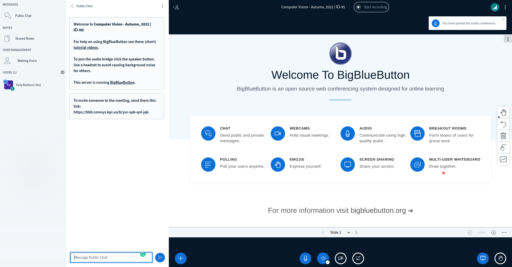
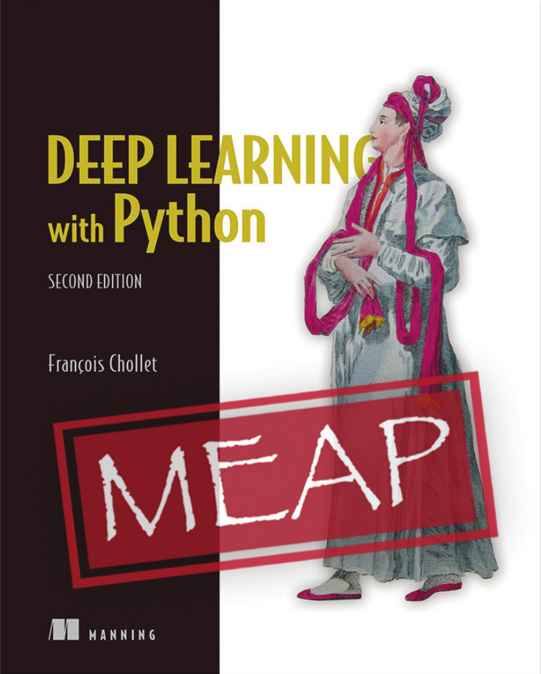

class: middle, center, title-slide 

# Системи штучного інтелекту

Осінь 2022

  
Кочура Юрій Петрович 
[iuriy.kochura@gmail.com](mailto:iuriy.kochura@gmail.com)  
<a href="https://t.me/y_kochura">@y_kochura</a>  

---

# Викладач

Лекції та практики :
- Кочура Юрій Петрович 
  - Кафедра обчислювальної техніки, ФІОТ

 

.center[
.circle.width-40[]
]

---

class: middle

# Опис предмету

Цей курс познайомить Вас з пiдходами, якi лежать в основi машинного та глибинного навчання та дозволить отримати практичний досвiд: 

- Використання нейронних мереж (повноз’єднанi та згортковi шари, пряме та зворотне поширення, активацiйнi функцiї, ...)
- Тренування нейронних мереж (iнiцiалiзацiя, оптимiзацiя, регуляризацiя, вибiр моделей, ...)

---

# Програмне забезпечення

Цього семестру лекції проходять онлайн в .bold[*BigBlueButton*] at  [https://bbb.comsys.kpi.ua/b/yur-h7j-fwv-yhv](https://bbb.comsys.kpi.ua/b/yur-h7j-fwv-yhv)

.center.width-90[]

---

class: middle 

# Матеріали лекцій

-  HTML та PDF формат
- Надсилатись будуть після занять у телеграм групу

<!-- .center.width-80[] -->

---

class: middle

# Підручники

 Обов’язкового підручника немає, але я хотів би порекомендувати кілька книг для більш повного ознайомлення з предметом:

.grid[
.kol-1-3[
[.center.width-80[]](https://www.deeplearningbook.org/)
.center[Безкоштовна]
]

.kol-1-3[
[.center.width-95[]](http://neuralnetworksanddeeplearning.com/index.html)
.center[Безкоштовна]
]

.kol-1-3[
[.center.width-80[]](https://www.manning.com/books/deep-learning-with-python-second-edition?query=deep/)
.center[Безкоштовний перегляд]
  ]
]

---

class: middle

# Обговорення

Оголошення та обговорення відбуватимуться в Telegram

- Задавайте свої запитання.
- Не соромтесь!

---

class: middle

## Практичні роботи

Вправи, які допоможуть познайомитись з предметом.

---

class: middle

# Оцінювання

- 60%  &nbsp;&emsp; Практичні роботи (30% кожна)
- 40%  &nbsp;&emsp; Екзамен

**Примітка!** Допуск до здачі екзамену: 
  Практичні роботи $ \geq 42\%$

---

class: end-slide, center
count: false

.larger-xx[Почнемо!]