class: middle, center, title-slide 

# Системи штучного інтелекту

Лекція 1-2: Вступ до штучного інтелекту

  
Кочура Юрій Петрович 
[iuriy.kochura@gmail.com](mailto:iuriy.kochura@gmail.com)  
<a href="https://t.me/y_kochura">@y_kochura</a>  

---

class: middle

# Сьогодні

- Інтелект vs штучний інтелект
- Визначення штучного інтелекту та парадигма
- Типи машинного навчання
- Концепція глибинного навчання
- Приклади застосування глибинного навчання
- Перцептрон: пряме та зворотне поширення
- Загальні функції активації

---

class: blue-slide, middle, center
count: false

.larger-xx[Штучний інтелект]

---

class: middle

# Чи може машина думати?
.grid[
.kol-2-3[
.width-90[]

.pull-right[&mdash; Alan Turing, 1950]
]

.kol-1-3[.center.circle.width-70[]

.center.smaller-xxx[Image source: [biography](https://www.biography.com/scientist/alan-turing)]
  ]
]

.footnote[Credits: [Alan Turing](https://academic.oup.com/mind/article/LIX/236/433/986238), 1950.]

---

class: middle
count: false

.smaller-x.italic[
In the process of trying to imitate an adult human mind we are bound to think a good deal about
the process which has brought it to the state that it is in. We may notice three components,

  a. The initial state of the mind, say at birth,

  b. The education to which it has been subjected,

  c. Other experience, not to be described as education, to which it has been subjected.

Instead of trying to produce a programme to simulate the adult mind, why not rather try to produce
one which simulates the child’s? If this were then subjected to an appropriate course of education one
would obtain the adult brain. Presumably the child-brain is something like a note-book as one buys
it from the stationers. Rather little mechanism, and lots of blank sheets. (Mechanism and writing
are from our point of view almost synonymous.) Our hope is that there is so little mechanism in
the child-brain that something like it can be easily programmed.

]

.pull-right[&mdash; Alan Turing, 1950]

.footnote[Credits: [Alan Turing](https://academic.oup.com/mind/article/LIX/236/433/986238), 1950.]

---

class: middle

# Що таке інтелект?

- Інтелект &mdash; це про здатність

.bold.center.larger-x[навчатися приймати рішення для досягнення цілей]
   

- Навчання, прийняття рішення, та цілі є ключовими

---

class: middle

# Що таке штучний інтелект?

- У широкому сенсі 

.bold.larger-x[Будь-яка техніка, яка дозволяє комп'ютерам імітувати поведінку людини]
   
---

class: middle

# Що таке штучний інтелект?

- У вузькому сенсі 

.alert[
.bold.larger-x[**Штучний інтелект** &mdash; здатність інженерної системи обробляти, застосовувати та вдосконалювати здобуті знання та вміння.]]

- **Знання** &mdash; це факти, інформація та навички, набуті через досвід або навчання.

.footnote[Credits: [ISO/IEC TR 24028:2020(en)](https://www.iso.org/obp/ui/#iso:std:iso-iec:tr:24028:ed-1:v1:en:term:3.4), 2020.]

---

class: middle

## Коротка історія

.smaller-xx[
- 1940—1952: Early days
  - 1943: McCulloch & Pitts: Boolean circuit model of brain
  - 1950: Turing's ''Computing Machinery and Intelligence''

- 1952–1956:  The birth of AI
  - 1950s: Early AI programs, including Samuel's checkers program,
Newell & Simon's Logic Theorist, Gelernter's Geometry Engine
  - 1956: Dartmouth meeting: ''Artificial Intelligence'' adopted

- 1956–1974: The golden years 
  - 1958: Frank Rosenblatt invented [perceptron](https://en.wikipedia.org/wiki/Perceptron) (simple neural network)
  - 1964: [Bobrow's program](https://en.wikipedia.org/wiki/STUDENT_(computer_program) that solves algebra word problems
  - 1965: Robinson's complete algorithm for logical reasoning

- 1974–1980: The first AI winter

- 1980–1987: Expert systems industry boom
- 1987—1993: Expert systems industry busts: the second AI winter 

- 1993–2011: Statistical approaches 
  - Resurgence of probability, focus on uncertainty
  - General increase in technical depth
  - Intelligent agents

- 2011–present: Deep Learning, Big Data and AI
  - Big data, big compute, neural networks
  - AI used in many industries
]

.footnote[Credits: [Wikipedia - History of artificial intelligence](https://en.wikipedia.org/wiki/History_of_artificial_intelligence#Deep_learning)]

---

class: middle

# AI &mdash; багата галузь

.center.width-90[]

.footnote[Image Source: [Marizel B. and Ma. Louella Salenga](https://www.researchgate.net/publication/324183626_Bitter_Melon_Crop_Yield_Prediction_using_Machine_Learning_Algorithm), 2018.]

---

class: middle

.center.width-90[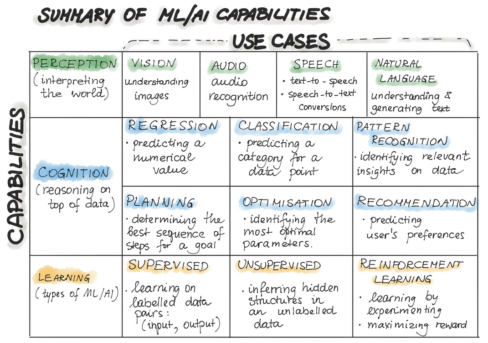]

.footnote[Image Source: [Why you Might Want to use Machine Learning](https://ml-ops.org/content/motivation).]

---

class: middle

.center.width-50[]

"Just as electricity transformed almost everything 100 years ago, today I actually have a hard time thinking of an industry that I don't think AI will transform in the next several years."

.pull-right[&mdash; Andrew Ng]

.footnote[Credits: [Andrew Ng: Artificial Intelligence is the New Electricity](https://www.youtube.com/watch?v=21EiKfQYZXc), 2017.]

---

class: blue-slide, middle, center
count: false

.larger-xx[Машинне навчання]

---

class: middle

# Що таке машинне навчання?

.grid[
.kol-2-3[
.width-90[]

Field of study that gives computers the ability to learn without being explicitly programmed.
.pull-right[&mdash; Arthur Samuel, 1959]
]

.kol-1-3[.center.circle.width-60[]

.center.smaller-xxx[Image source: [wikipedia](https://en.wikipedia.org/wiki/Arthur_Samuel#/media/File:This_is_the_photo_of_Arthur_Samuel.jpg)]
  ]
]

.footnote[Credits: [Arthur Samuel](http://users.auth.gr/kehagiat/Research/GameTheory/12CombBiblio/Checkers_Samuels_ibmrd1106C.pdf), 1959.]

---

class: middle

# Що таке машинне навчання?

.grid[
.kol-2-3[

Machine Learning is the study of computer algorithms that improve automatically through experience.

.pull-right[&mdash; Tom Mitchell, 1997]
]

.kol-1-3[.center.width-100[]

.center.smaller-xxx[Image source: [Tom Mitchell's Home Page](http://www.cs.cmu.edu/~tom/)]
  ]
]

.footnote[Credits: [Tom Mitchell](http://www.cs.cmu.edu/~tom/mlbook.html), 1997.]

---

class: middle

# Машинне навчання: нова парадигма програмування

.center.width-90[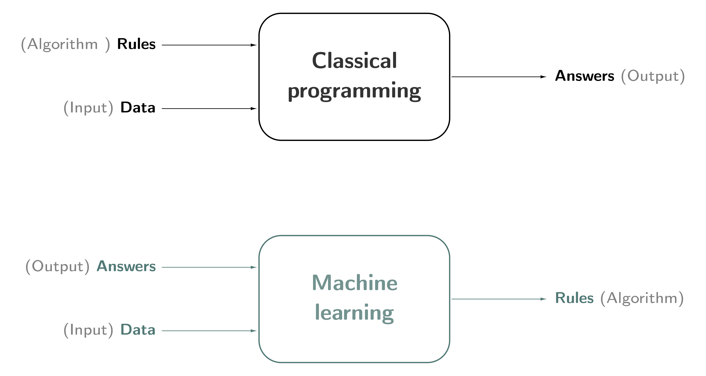]

---

class: middle

# Типи машинного навчання

.center[
.width-100[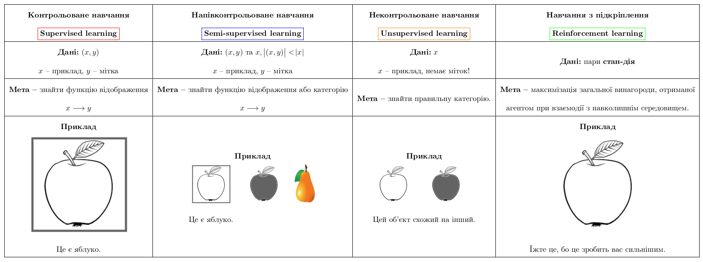]
]

---

class: middle

# What is Deep Learning?

.center.width-90[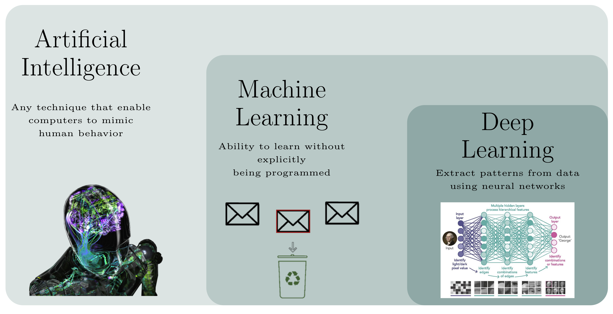]

.footnote[Slide source: [MIT 6.S191](http://introtodeeplearning.com/)]

---

class: middle

# Чому глибинне навчання (DL)?

Ознаки, розроблені вручну, займають багато часу, є крихкими та не підлягають масштабуванню на практиці

Чи можемо ми вивчити **основні ознаки** безпосередньо з даних?

.center.width-90[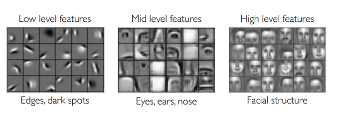]

.footnote[Slide source: [MIT 6.S191](http://introtodeeplearning.com/)]

---

# Чому DL працює зараз?

.grid[
.kol-1-2[
Algorithms (old and new)  
.width-90[]
]
.kol-1-2[
More data
.smaller-xx[
- Larger Datasets
- Easier Collection & Storage
]

.center.width-50[]
]
]

.center.grid[
.kol-1-2[
Software (New models and improved techniques) 
.width-90[]
]
.kol-1-2[
Faster compute engines  
.width-50[]
]
]

???

The success of deep learning is multi-factorial...

---

class: middle

## DL як архітектурна мова

.width-100[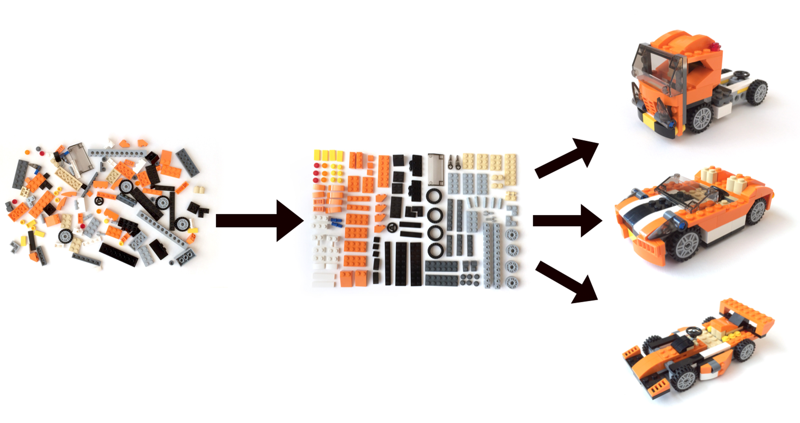]

.footnote[Image source: [http://chelseamarzean.com/post-the-atomic-workflow/](http://chelseamarzean.com/post-the-atomic-workflow/), 2016.]

---

class: middle

.center.circle.width-30[]

.center.smaller-xxx[Image source: [Christopher Bishop](https://www.microsoft.com/en-us/research/people/cmbishop/)]

.italic[For the last forty years we have programmed computers; for the next forty years we will train them.]

.pull-right[&mdash; Chris Bishop, 2020.]

.footnote[Credits: [Chris Bishop on "The Real AI Revolution" NeurIPS 2020](https://www.ml6.eu/knowhow/ml6-at-neurips-2020)]

---

class: middle 

.center.width-70[]

.italic["ACM named .bold[Yann LeCun], .bold[Geoffrey Hinton], and .bold[Yoshua Bengio] recipients of the .bold[2018 ACM A.M. Turing Award] for conceptual and engineering breakthroughs that have made deep neural networks a critical component of computing."]

.footnote[Credits: [Wikipedia](https://en.wikipedia.org/wiki/Turing_Award)]

---

class: blue-slide, middle, center
count: false

.larger-xx[Застосування та успіхи]

---

class: middle, center, black-slide

<iframe width="600" height="450" src="https://www.youtube.com/embed/5kpsZoKjPgQ" frameborder="0" allowfullscreen></iframe>

Object detection, pose estimation, segmentation (2019)

---

class: middle, center, black-slide

<iframe width="600" height="450" src="https://www.youtube.com/embed/V1eYniJ0Rnk" frameborder="0" allowfullscreen></iframe>

Reinforcement learning (Mnih et al, 2014)

---

class: middle, center, black-slide

<iframe width="600" height="450" src="https://www.youtube.com/embed/HcZ48JDamyk" frameborder="0" allowfullscreen></iframe>

Strategy games (Deepmind, 2016-2018)

---

class: middle, center, black-slide

<iframe width="600" height="450" src="https://www.youtube.com/embed/qhUvQiKec2U" frameborder="0" allowfullscreen></iframe>

Autonomous cars (NVIDIA, 2016)

---

class: middle, center, black-slide

<iframe width="600" height="450" src="https://www.youtube.com/embed/tlThdr3O5Qo" frameborder="0" allowfullscreen></iframe>

Autopilot (Tesla, 2019)

???

A full build of Autopilot neural networks involves 48 networks that take 70,000 GPU hours to train 🔥. Together, they output 1,000 distinct tensors (predictions) at each timestep.

---

class: middle, black-slide

.center[
<video loop controls preload="auto" height="400" width="600">
  <source src="./figures/lec1/physics-simulation.mp4" type="video/mp4">
</video>

Physics simulation (Sanchez-Gonzalez et al, 2020)

]

---

class: middle, black-slide, center

<iframe width="600" height="450" src="https://www.youtube.com/embed/gg7WjuFs8F4" frameborder="0" allowfullscreen></iframe>

AI for Science (Deepmind, AlphaFold, 2020)

---

class: middle, center, black-slide

<iframe width="600" height="450" src="https://www.youtube.com/embed/7gh6_U7Nfjs" frameborder="0" allowfullscreen></iframe>

Speech synthesis and question answering (Google, 2018)

---

class: middle, center, black-slide

<iframe width="600" height="450" src="https://www.youtube.com/embed/Khuj4ASldmU" frameborder="0" allowfullscreen></iframe>

Artistic style transfer (Ruder et al, 2016)

---

class: middle, center, black-slide

<iframe width="600" height="450" src="https://www.youtube.com/embed/kSLJriaOumA" frameborder="0" allowfullscreen></iframe>

Image generation (Karras et al, 2018)

---

class: middle, center, black-slide

<iframe width="600" height="450" src="https://www.youtube.com/embed/egJ0PTKQp4U?start=223" frameborder="0" allowfullscreen></iframe>

Music composition (NVIDIA, 2017)

---

class: middle, center, black-slide

<iframe width="600" height="450" src="https://www.youtube.com/embed/BIDaxl4xqJ4" frameborder="0" allowfullscreen></iframe>

Dali Lives (2019)

---

class: middle, center, black-slide

<iframe width="600" height="450" src="https://www.youtube.com/embed/J_2fIGmsoRg" frameborder="0" allowfullscreen></iframe>

Reface revived the famous Kyiv murals for Kyiv Day (2021)

---

class: blue-slide, middle, center
count: false

.larger-xx[Перцептрон]

Структурний будівельний блок глибокого навчання

---

# Перцептрон

Модель перцептрона (Rosenblatt, 1958)

$$g(z) = \begin{cases}
   1 &\text{if } z =\sum_i w_i x_i + b \geq 0  \\\\
   0 &\text{otherwise}
\end{cases}$$

Ця модель спочатку була мотивована біологією, де $w_i$ &mdash; синаптичні ваги для вхідних сигналів $x_i$ та $g$ &mdash; активація нейрона.
.center.width-65[]

.footnote[Image source: Frank Rosenblatt, [Mark I Perceptron operators' manual](https://apps.dtic.mil/sti/pdfs/AD0236965.pdf), 1960.]

???

In November 1958 Frank Rosenblatt invented the Perceptron, or Mark I, at Cornell University. Completed in 1960, this was the first computer that could learn new skills by trial and error, using a type of neural network that simulated human thought processes.

---

class: middle

# Біологічний vs штучний нейрон 

.center[
.width-100[]
]

---

class: middle

.center[
.width-100[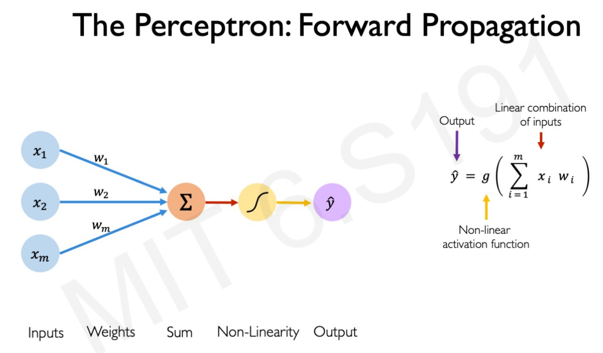]
]

.footnote[Slide source: [MIT 6.S191](http://introtodeeplearning.com/)]

---

class: middle

.center[
.width-100[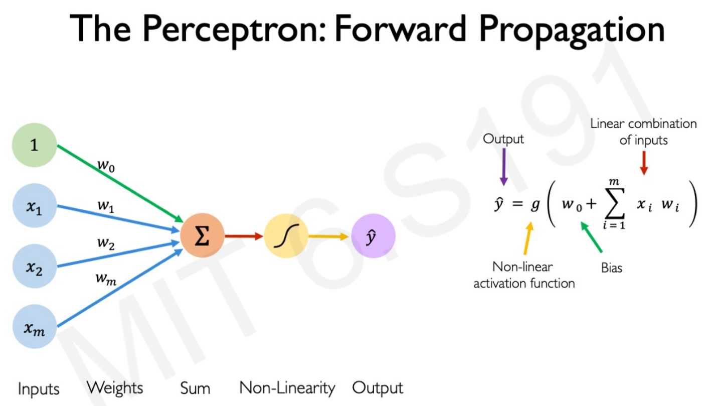]
]

.footnote[Slide source: [MIT 6.S191](http://introtodeeplearning.com/)]

---

class: middle

.center[
.width-100[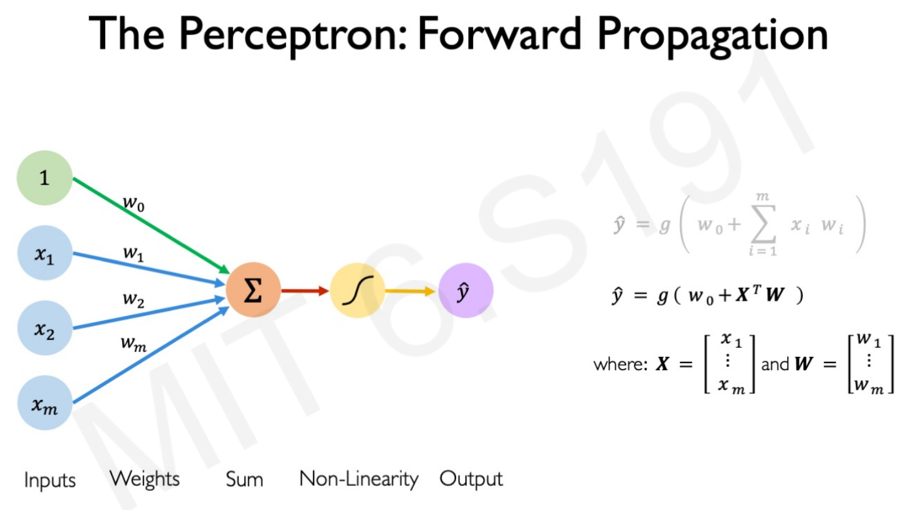]
]

.footnote[Slide source: [MIT 6.S191](http://introtodeeplearning.com/)]

---

class: middle

.center[
.width-100[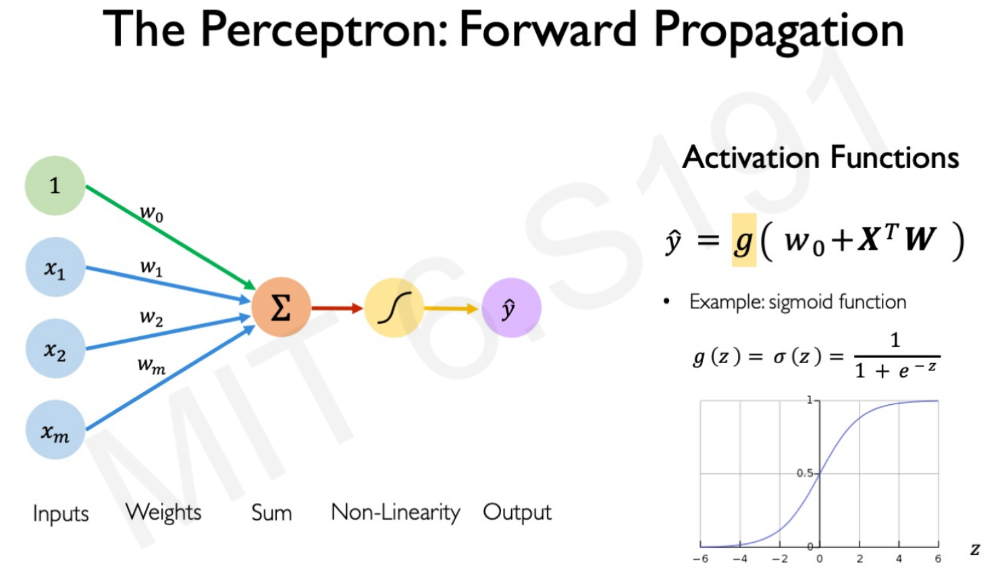]
]

.footnote[Slide source: [MIT 6.S191](http://introtodeeplearning.com/)]

---

class: middle

.center[
.width-70[]
]

.smaller-xx[
$$
\begin{aligned}
\mathbf{X} = \begin{bmatrix}
x\_1  \\\\
x\_2  \\\\
\vdots \\\\
x\_m
\end{bmatrix} 
&&
\mathbf{W} = \begin{bmatrix}
w\_1  \\\\
w\_2  \\\\
\vdots \\\\
w\_m
\end{bmatrix}
&& 
\mathbf{X}^T = \begin{bmatrix}
x\_1 & x\_2 & \cdots & x\_m
\end{bmatrix} 
\end{aligned}$$

$$\boxed{\begin{aligned}z &= \sum\_{n=1}^{m} w\_n x\_n + b = \mathbf{X}^T \cdot \mathbf{W} + b = \mathbf{W}^T \cdot \mathbf{X} + b \\\\
\hat y &= g(z) \\\\
\mathcal{L}(\hat y, y) &= - \frac{1}{n} \sum\_{i=1}^{n} \big(y^{(i)} \log(\hat y^{(i)}) + (1- y^{(i)}) \log(1 -\hat y^{(i)}) \big)
\end{aligned}}$$

]

---

class: middle

.center[
.width-80[]
]

.smaller-xx[

.center[*Пряме поширення*]

$$\boxed{\begin{aligned}z &= \sum\_{n=1}^{m} w\_n x\_n + b = \mathbf{X}^T \cdot \mathbf{W} + b = \mathbf{W}^T \cdot \mathbf{X} + b \\\\
\hat y &= g(z) \\\\
\mathcal{L}(\hat y, y) &= - \frac{1}{n} \sum\_{i=1}^{n} \big(y^{(i)} \log(\hat y^{(i)}) + (1- y^{(i)}) \log(1 -\hat y^{(i)}) \big)
\end{aligned}}$$

]

---

class: middle

# Загальні функції активації

.center[
.width-100[]
]

---

class: middle

.center[
.width-100[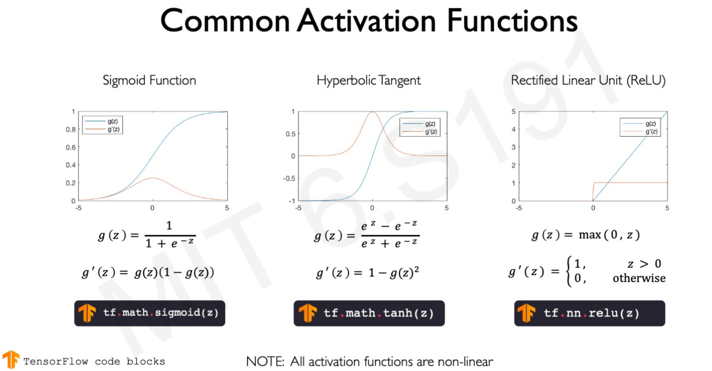]
]

.footnote[Slide source: [MIT 6.S191](http://introtodeeplearning.com/)]

---

class: middle

.center[
.width-100[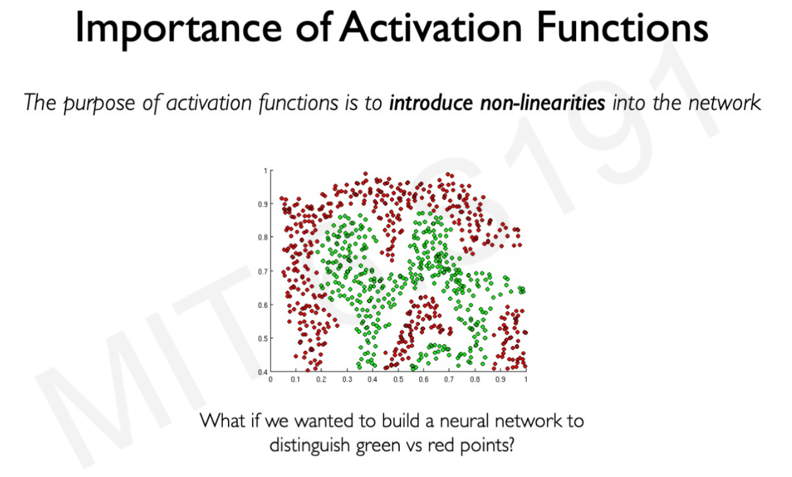]
]

.footnote[Slide source: [MIT 6.S191](http://introtodeeplearning.com/)]

---

class: middle

.center[
.width-100[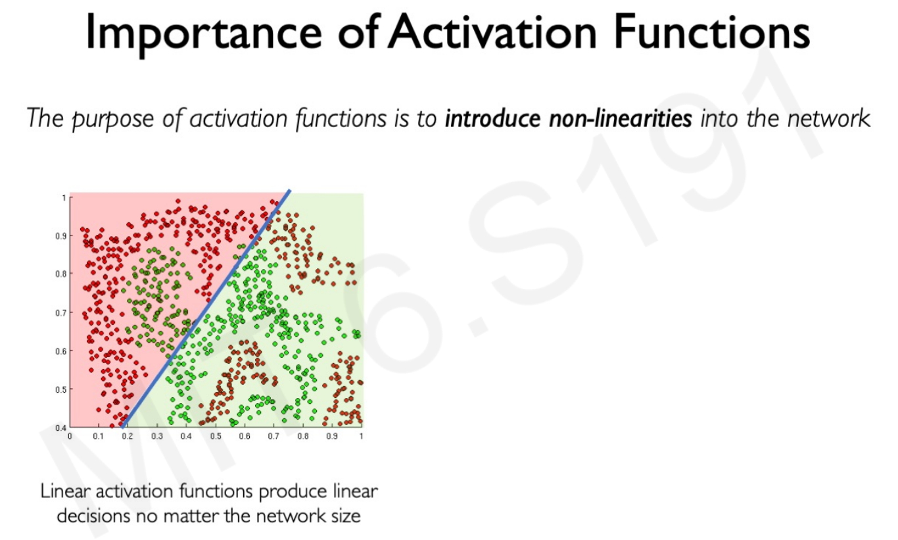]
]

.footnote[Slide source: [MIT 6.S191](http://introtodeeplearning.com/)]

---

class: middle

.center[
.width-100[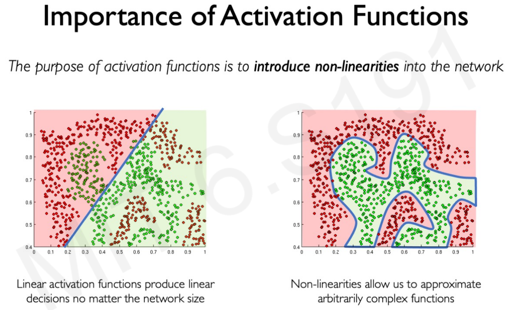]
]

.footnote[Slide source: [MIT 6.S191](http://introtodeeplearning.com/)]

---

class: middle

.center[
.width-100[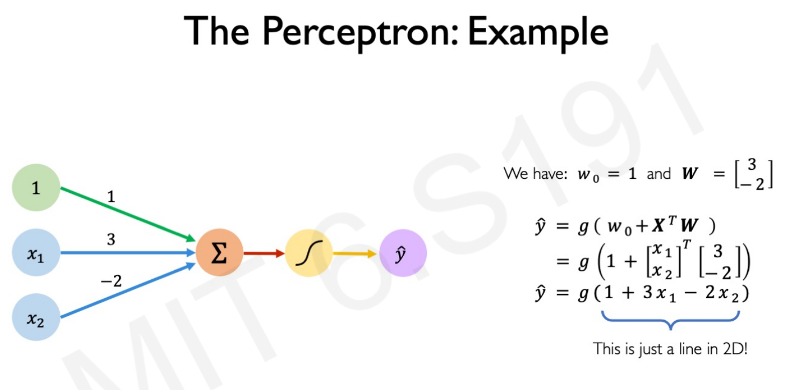]
]

.footnote[Slide source: [MIT 6.S191](http://introtodeeplearning.com/)]

---

class: middle

.center[
.width-100[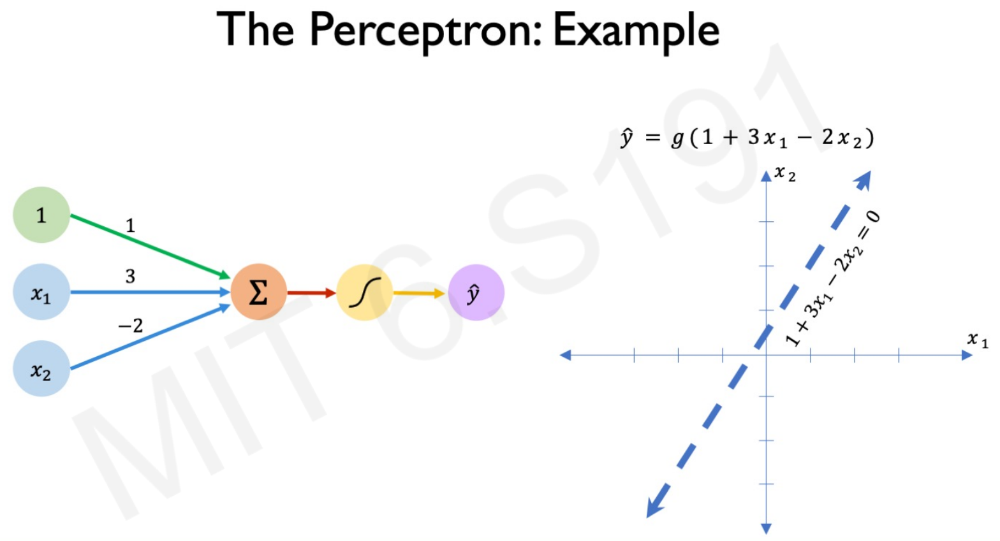]
]

.footnote[Slide source: [MIT 6.S191](http://introtodeeplearning.com/)]

---

class: middle

.center[
.width-100[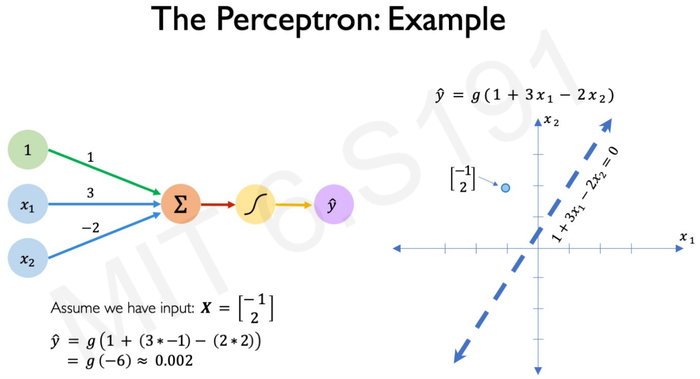]
]

.footnote[Slide source: [MIT 6.S191](http://introtodeeplearning.com/)]

---

class: middle

.center[
.width-100[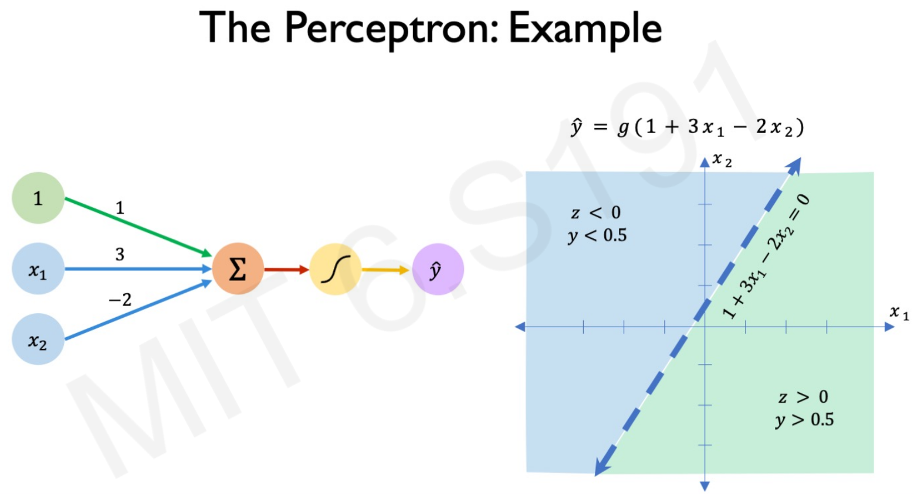]
]

.footnote[Slide source: [MIT 6.S191](http://introtodeeplearning.com/)]

---

class: middle

## Приклад 2

Припустимо кількість вхідних ознак $m = 3$

$$
\begin{aligned}
\mathbf{X} = \begin{bmatrix}
x\_1  \\\\
x\_2  \\\\
x\_3
\end{bmatrix} = \begin{bmatrix}
-0.1  \\\\
0.7  \\\\
0.5
\end{bmatrix} 
&&
\mathbf{W} = \begin{bmatrix}
w\_1  \\\\
w\_2  \\\\
w\_3
\end{bmatrix} =
\begin{bmatrix}
1  \\\\
-2  \\\\
2
\end{bmatrix}
&&
b = 0.8
\end{aligned}$$

$$\boxed{\begin{aligned}
z = \sum_{n=1}^{3} w_n x_n + b &= w_1 x_1 + w_2 x_2 + w_3 x_3 + b = \\\\
&= 1 \cdot -0.1 + -2 \cdot 0.7 + 2 \cdot 0.5 + 0.8 = 0.3
\end{aligned}}$$

$$\boxed{\begin{aligned}
z = \mathbf{X}^T \cdot \mathbf{W} + b &= \begin{bmatrix}
x\_1 & x\_2 &  x\_3 
\end{bmatrix} \begin{bmatrix}
w\_1  \\\\
w\_2  \\\\
w\_3
\end{bmatrix} + b = \\\\
&= w_1 x_1 + w_2 x_2 + w_3 x_3 + b = 0.3
\end{aligned}}$$

$$\hat y  = g(z) = g(\mathbf{X}^T \cdot \mathbf{W} + b) = \frac{1}{1 + \exp(-z)} = \frac{1}{1 + \exp(-0.3)} \approx 0.57 $$

---

class: blue-slide, middle, center
count: false

.larger-xx[Одновимірний градієнтний спуск]

---

class: middle

## Одновимірний градієнтний спуск
.smaller-x[

Розглянемо деяку неперервну диференційовану дійсну функцію $f: \mathbb{R} \rightarrow \mathbb{R}$. Розкладаючи у ряд Тейлора, ми отримуємо::

$$f(x + \varepsilon) = f(x) + \varepsilon f^{'}(x) + \mathcal{O}(\varepsilon^2)$$

Щоб усе було просто, давайте виберемо фіксований розмір кроку $\alpha > 0$ та оберемо $\varepsilon = -\alpha f^{'}(x)$. Підставляючи це у ряд Тейлора, отримаємо:

$$f(x -\alpha f^{'}(x)) = f(x) - \alpha f^{'2}(x)  + \mathcal{O}(\alpha^2 f^{'2}(x))$$

Якщо похідна $f^{'}(x) \neq 0$ не зникає ми робимо прогрес так як $\alpha f^{'2}(x) > 0$. Крім того, ми завжди можемо вибрати $\alpha$ досить малим, щоб вирази вищих порядків стали нерелевантними. Тому ми приходимо до

$$f(x -\alpha f^{'}(x)) \lessapprox f(x)$$

Це означає, якщо ми використовуємо

$$x \leftarrow x -\alpha f^{'}(x)$$

для ітерації по $x$, значення функції  $f(x)$  може зменшитись. 
]

???
Gradient descent in one dimension is an excellent example to explain why the gradient descent algorithm may reduce the value of the objective function.

The Taylor series is used to describe what the function looks like in the neighborhood of some poin $x$.

That is, in first-order approximation $f(x + \varepsilon)$  is given by the function value $f(x)$ and the first derivative $f^{'}(x)$ at $x$. It is not unreasonable to assume that for small $\varepsilon$ moving in the direction of the negative gradient will decrease $f$. 

Therefore, in gradient descent we first choose an initial value $x$ and a constant $\alpha > 0$ and then use them to continuously iterate $x$ until the stop condition is reached, for example, when the magnitude of the gradient $|f^{'}(x)|$ is small enough or the number of iterations has reached a certain value.

---

class: middle

.center[
.width-80[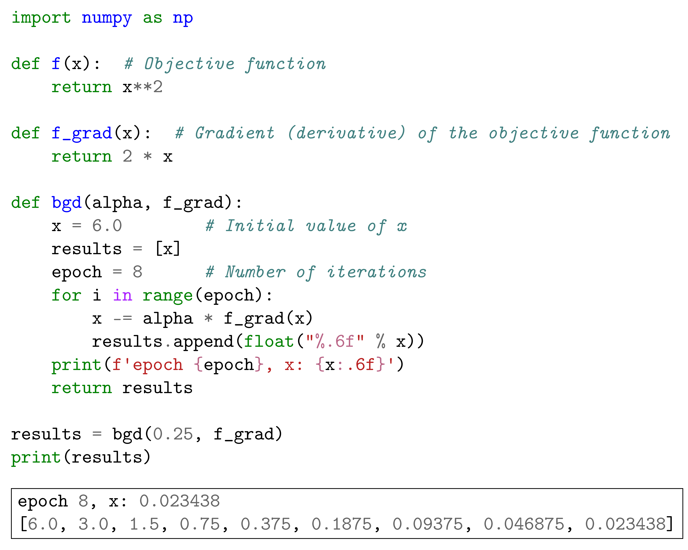]
]

???

For simplicity we choose the objective function $f(x) = x^2$ to illustrate how to implement gradient descent. Although we know that $x = 0$ is the solution to minimize $f(x)$, we still use this simple function to observe how $x$ changes.

---

class: middle

The progress of optimizing over $x$ 

.center[
.width-80[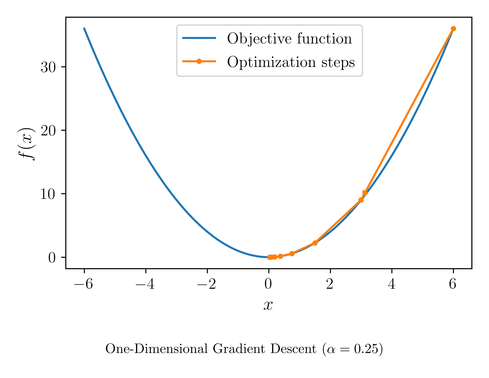]
]

---

class: middle

The progress of optimizing over $x$ 

.center[
.width-80[]
]

???
If we use a learning rate that is too small, it will cause $x$ to update very slowly, requiring more iterations to get a better solution.

---

lass: middle

The progress of optimizing over $x$ 

.center[
.width-80[]
]

???
if we use an excessively high learning rate, $|\alpha f^{'}(x)|$ might be too large for the first-order Taylor expansion formula. That is, the term $\mathcal{O}(\alpha^2 f^{'2}(x))$ might become significant. In this case, we cannot guarantee that the iteration of $x$ will be able to lower the value of $f(x)$.

---

class: blue-slide, middle, center
count: false

.larger-xx[Перцептрон: Зворотне поширення]

---

class: middle

In Leibniz notations, the **chain rule** states that
$$
\begin{aligned}
\frac{\partial \ell}{\partial \theta\_i} &= \sum\_{k \in \text{parents}(\ell)} \frac{\partial \ell}{\partial u\_k} \underbrace{\frac{\partial u\_k}{\partial \theta\_i}}\_{\text{recursive case}}
\end{aligned}$$

---

class: middle

## Backpropagation

- Since a neural network is a **composition of differentiable functions**, the total
derivatives of the loss can be evaluated backward, by applying the chain rule
recursively over its computational graph.
- The implementation of this procedure is called reverse *automatic differentiation* or **backpropagation**.

---

class: middle

.smaller-xx[

.center[*Forward propagation*]

$$\boxed{\begin{aligned}z &= \sum\_{n=1}^{m} w\_n x\_n + b = \mathbf{X}^T \cdot \mathbf{W} + b = \mathbf{W}^T \cdot \mathbf{X} + b \\\\
\hat y &= g(z) = \sigma(z) = \frac{1}{1 + \exp(-z)} \\\\
\mathcal{L}(\hat y, y) &= - \frac{1}{n} \sum\_{i=1}^{n} \big(y^{(i)} \log(\hat y^{(i)}) + (1- y^{(i)}) \log(1 -\hat y^{(i)}) \big)
\end{aligned}}$$

.grid[
.kol-2-3[

.center[*Backward propagation*]

$$\boxed{\begin{aligned}
\frac{\partial \mathcal{L}(\hat y, y)}{\partial \hat y} &= -\frac{y}{\hat y} + \frac{1- y}{1 - \hat y} \\\\[18pt]
\frac{\partial \mathcal{L}(\hat y, y)}{\partial z} &= \frac{\partial \mathcal{L}(\hat y, y)}{\partial \hat y} \frac{\partial \hat y}{\partial z} = \hat y - y \\\\[18pt]
\frac{\partial \mathcal{L}(\hat y, y)}{\partial \mathbf{W}} &= \frac{\partial \mathcal{L}(\hat y, y)}{\partial \hat y} \frac{\partial \hat y}{\partial z} \frac{\partial z}{\partial \mathbf{W}} = \mathbf{X}^T \cdot (\hat y - y) \\\\[18pt]
\frac{\partial \mathcal{L}(\hat y, y)}{\partial b} &=  \frac{\partial \mathcal{L}(\hat y, y)}{\partial \hat y} \frac{\partial \hat y}{\partial z} \frac{\partial z}{\partial b} = \hat y - y
\end{aligned}}$$
]

.kol-1-3[
.center[*Update the weights and bias*]

$$\boxed{\begin{aligned}
\mathbf{W} &= \mathbf{W} - \alpha \frac{\partial \mathcal{L}(\hat y, y)}{\partial \mathbf{W}} \\\\[18pt]
b &= b - \alpha \frac{\partial \mathcal{L}(\hat y, y)}{\partial b}
\end{aligned}}$$
]]
]

---

class: blue-slide, middle, center
count: false

.larger-xx[Multi Output Perceptron]

---

class: middle

# Multi Output Perceptron

.smaller-x[Because all inputs are densely connected to all outputs, these layers are called *Dense* layers]

.center[
.width-70[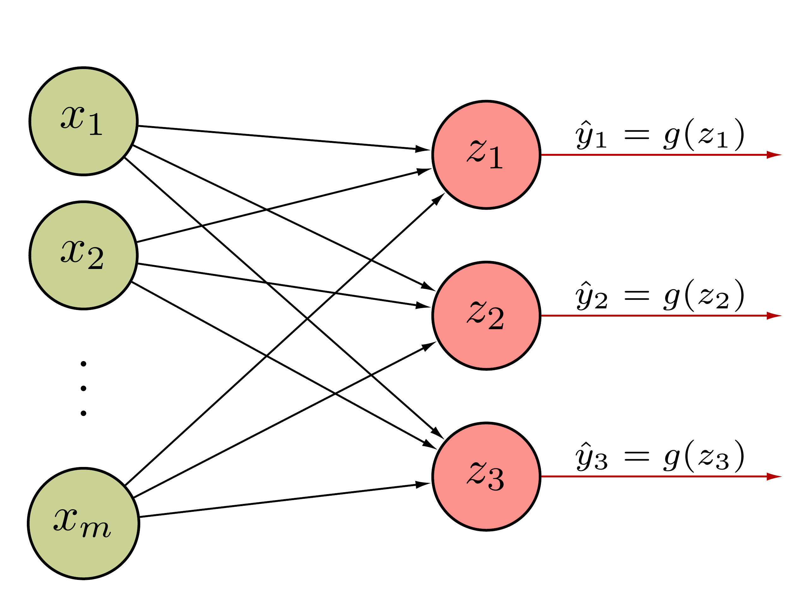]
]

$$z\_j = \sum\_{n=1}^{m} w\_{j, n} x\_n  + b\_j$$

---

class: middle

## Example

.center[
.width-50[]
]
.smaller-xx[
$$\begin{aligned}
\mathbf{X}^{m \times 1} = \begin{bmatrix}
x\_1  \\\\
x\_2  \\\\
\vdots \\\\
x\_m
\end{bmatrix} 
&&
\mathbf{W}^{3 \times m} = \begin{bmatrix}
w\_{11} & w\_{12} &  \cdots & w\_{1m} \\\\
w\_{21} & w\_{22} & \cdots & w\_{2m} \\\\
w\_{31} & w\_{32} & \cdots & w\_{3m}
\end{bmatrix}
&& 
\mathbf{b}^{3 \times 1} = \begin{bmatrix}
b\_1 \\\\
b\_2 \\\\
b\_3
\end{bmatrix}
\end{aligned}$$

$$\boxed{\begin{aligned}
\mathbf{z} =  \mathbf{W} \cdot \mathbf{X} + \mathbf{b} 
&= \begin{bmatrix}
w\_{11} & w\_{12} &  \cdots & w\_{1m} \\\\
w\_{21} & w\_{22} & \cdots & w\_{2m} \\\\
w\_{31} & w\_{32} & \cdots & w\_{3m}
\end{bmatrix} \cdot
\begin{bmatrix}
x\_1  \\\\
x\_2  \\\\
\vdots \\\\
x\_m
\end{bmatrix} + 
\begin{bmatrix}
b\_1 \\\\
b\_2 \\\\
b\_3
\end{bmatrix} = \\\\
&= 
\begin{bmatrix}
w\_{11} x\_1 + w\_{12} x\_2 +  \cdots + w\_{1m} x\_m + b\_1 \\\\
w\_{21} x\_1 + w\_{22} x\_2 +  \cdots + w\_{2m} x\_m + b\_2 \\\\
w\_{31} x\_1 + w\_{32} x\_2 +  \cdots + w\_{3m} x\_m + b\_3 
\end{bmatrix} = \begin{bmatrix}
z\_1 \\\\
z\_2 \\\\
z\_3
\end{bmatrix}
\end{aligned}}$$

]

---

class: middle

.smaller-x[Because all inputs are densely connected to all outputs, these layers are called *Dense* layers]

.center[
.width-100[]
]

$$z\_j = \sum\_{n=1}^{m} w\_{j, n} x\_n  + b\_j$$

---

class: blue-slide, middle, center
count: false

.larger-xx[Multilayer Perceptron]

---

class: middle

# One hidden layer Neural Network

.center[
.width-100[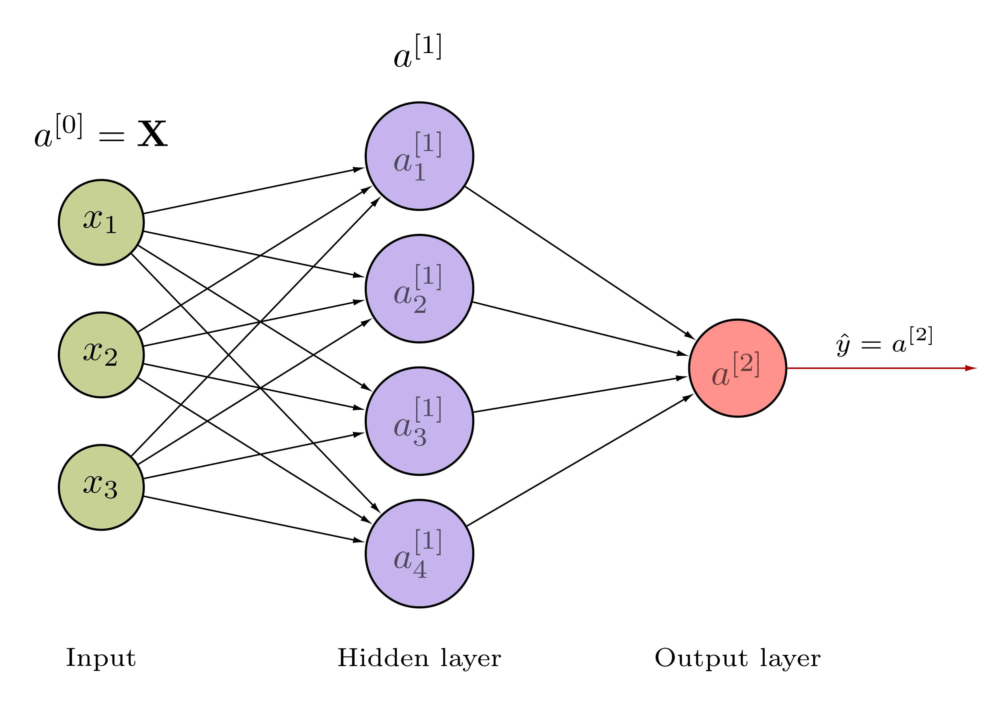]
]

---

class: middle

# One hidden layer Neural Network

.center[
.width-100[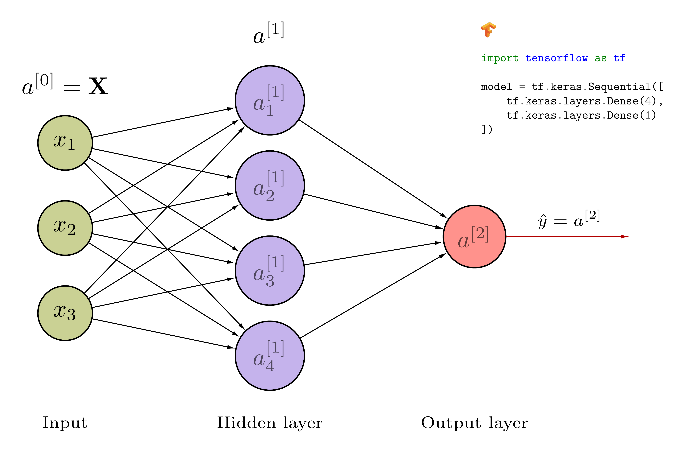]
]

---

class: middle

## One hidden layer Neural Network

.center[
.width-60[]
]

.smaller-xx[
$$\begin{aligned}
\mathbf{X} = \begin{bmatrix}
x\_1  \\\\
x\_2  \\\\
x\_3
\end{bmatrix} 
&&
\mathbf{W}^{[1]} = \begin{bmatrix}
w\_{11} & w\_{12} &  w\_{13} \\\\
w\_{21} & w\_{22} &  w\_{23} \\\\
w\_{31} & w\_{32} &  w\_{33} \\\\
w\_{41} & w\_{42} &  w\_{43}
\end{bmatrix}
&& 
\mathbf{b}^{[1]} = \begin{bmatrix}
b\_1 \\\\
b\_2 \\\\
b\_3 \\\\
b\_4
\end{bmatrix}
&&
\mathbf{W}^{[2]} = \begin{bmatrix}
w\_{1} & w\_{2} &  w\_{3} & w\_{4} 
\end{bmatrix}
&& 
b^{[2]} = b
\end{aligned}$$

$$\boxed{\begin{aligned}
\mathbf{z}^{[1]} &= \mathbf{W}^{[1]} \cdot \mathbf{X} + \mathbf{b}^{[1]} \\\\
\mathbf{a}^{[1]} &= g^{[1]}(\mathbf{z}^{[1]}) \\\\
z^{[2]} &= \mathbf{W}^{[2]} \cdot \mathbf{a}^{[1]} + b^{[2]} \\\\
\hat y &= a^{[2]} = g^{[2]}(z^{[2]})
\end{aligned}}$$
]

---

class: middle

# Deep Neural Network

.center[
.width-100[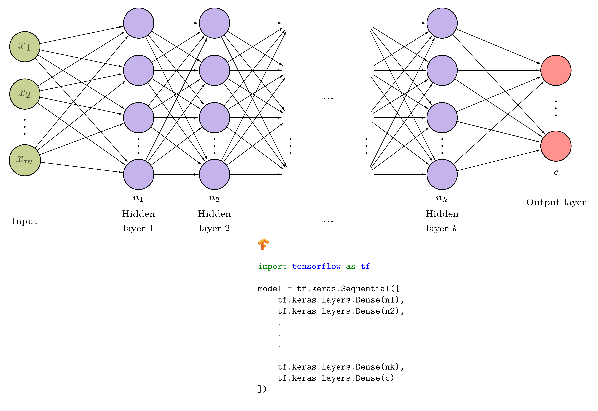]
]

---

class: blue-slide, middle, center
count: false

.larger-xx[Applying Neural Networks]

---

class: middle

.center[
.width-100[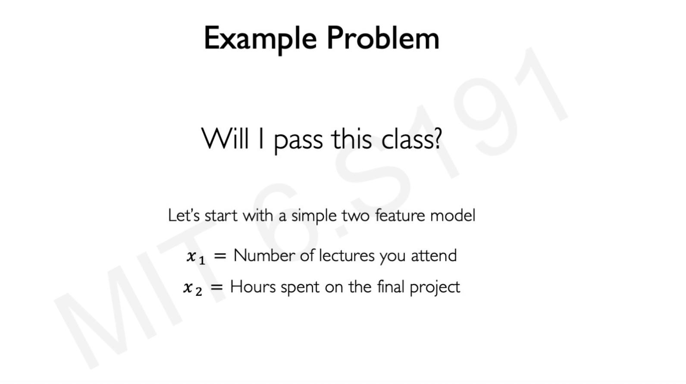]
]

.footnote[Slide source: [MIT 6.S191](http://introtodeeplearning.com/)]

---

class: middle

.center[
.width-100[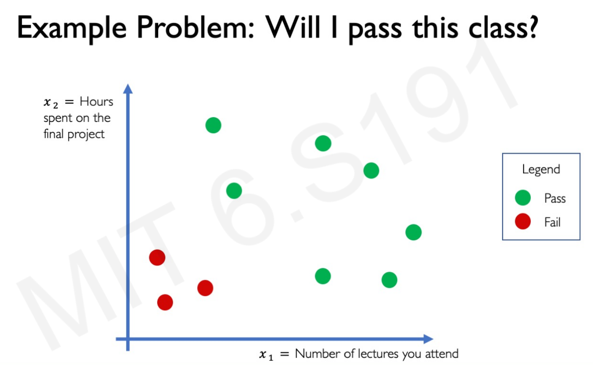]
]

.footnote[Slide source: [MIT 6.S191](http://introtodeeplearning.com/)]

---

class: middle

.center[
.width-100[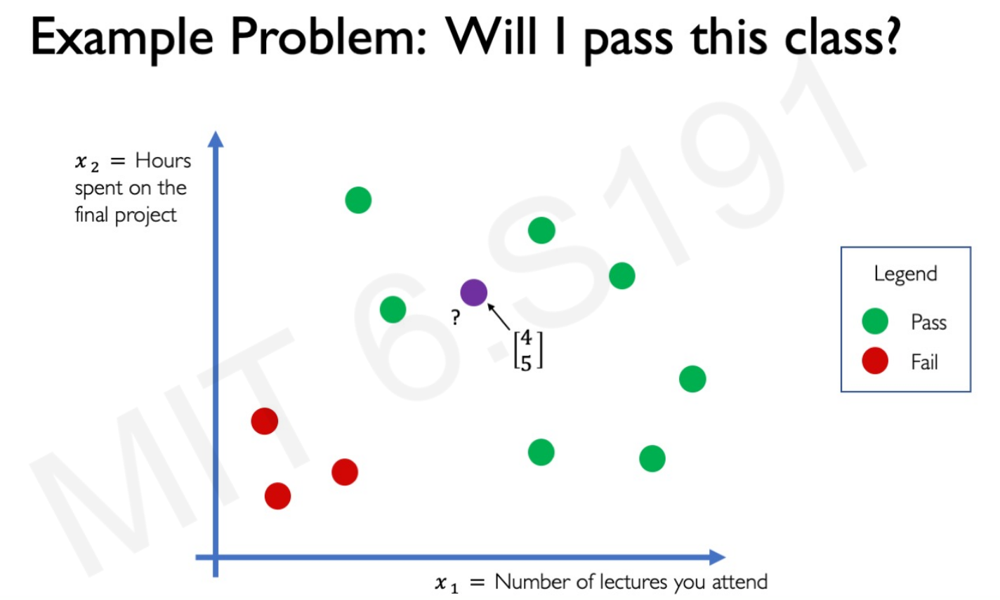]
]

.footnote[Slide source: [MIT 6.S191](http://introtodeeplearning.com/)]

---

class: middle

.center[
.width-100[]
]

.footnote[Slide source: [MIT 6.S191](http://introtodeeplearning.com/)]

---

class: middle

.center[
.width-100[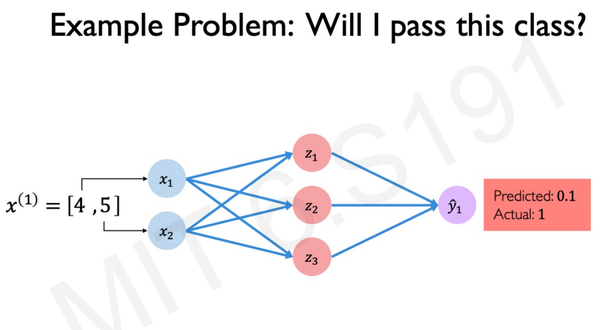]
]

.footnote[Slide source: [MIT 6.S191](http://introtodeeplearning.com/)]

---

class: middle

.center[
.width-100[]
]

.footnote[Slide source: [MIT 6.S191](http://introtodeeplearning.com/)]

---

class: middle

.center[
.width-100[]
]

.footnote[Slide source: [MIT 6.S191](http://introtodeeplearning.com/)]

---

class: middle

.center[
.width-100[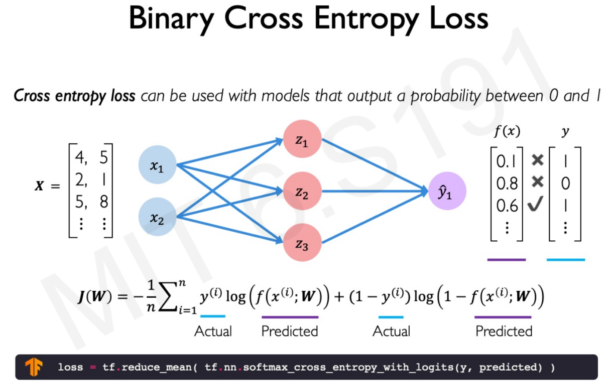]
]

.footnote[Slide source: [MIT 6.S191](http://introtodeeplearning.com/)]

---

class: middle

.center[
.width-100[]
]

.footnote[Slide source: [MIT 6.S191](http://introtodeeplearning.com/)]

---

class: end-slide, center
count: false

.larger-xx[Кінець]

